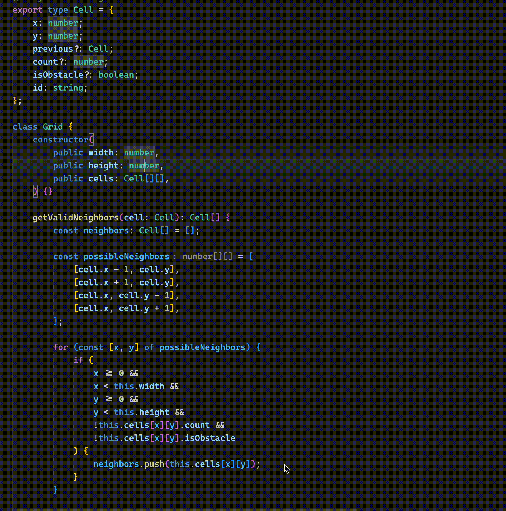
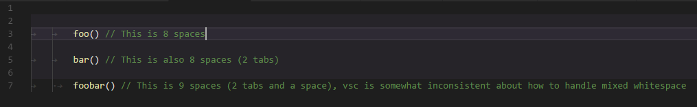

# Block Popper README

Highlights the intented area that contains the
cursor.

## Features

Highlight the selected block automatically like
so:

## Extension Settings

This extension contributes the following settings:

- `blockPopper.background`: Change the highlight
  color
- `blockPopper.omit`: Array of languages that will
  not be parsed by this extension
- `blockPopper.isWholeLine`: Option to highlight
  the entire line or only the text
- `blockPopper.accentCurrentLine`: Option to
  choose to accent the current line more intensely
  than the rest of the block

## Known Issues

**Improper indentation levels for lines with mixed
whitespace:**

Indenting the **same** line with a mixture of tabs
and spaces causes improper behavior because of how
VSC auto adjusts whitespace

Example of issue:

This extension does not parse syntax, it simply
checks indentation levels.

Unindented text is not highlighted; This is
intentional.

## Release Notes

### 0.0.1

Initial Commit
